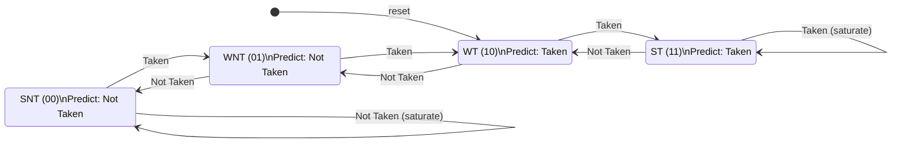

## How it works

This project implements a **2-Bit Branch Predictor** using a Pattern History Table (PHT). Branch predictors are a fundamental component of modern out-of-order processors and are a core topic in computer architecture.

### Background

When a processor fetches instructions from a branch, it needs to guess whether the branch will be taken or not *before* the branch is resolved. A wrong guess causes a pipeline flush, which is costly. A 2-bit saturating counter improves over a 1-bit predictor by requiring two consecutive mispredictions before flipping the prediction — this provides **hysteresis**, which helps with loops and regularly-taken branches.

### Design

The PHT contains **16 entries**, each a **2-bit saturating counter**:

| State                    | Value | Prediction |                  
| Strongly Not Taken (SNT) | `00`  | Not Taken |
| Weakly Not Taken (WNT)   | `01`  | Not Taken |
| Weakly Taken (WT)        | `10`  | **Taken** ← reset default |
| Strongly Taken (ST)      | `11`  | **Taken** |

The prediction is simply the **MSB** of the counter: `1` = Taken, `0` = Not Taken.

On a **taken** branch, the counter increments (saturates at `11`).
On a **not-taken** branch, the counter decrements (saturates at `00`).

The entry is selected using 4 bits of the PC (`pc_index`), giving 16 independently tracked branch sites.

### State Transition Diagram

### Pin Description

| Pin          | Direction | Description |

| `ui_in[3:0]` | Input     | `pc_index` — selects 1 of 16 PHT entries (lower PC bits) 
| `ui_in[4]`   | Input     | `outcome` — actual branch result: 1=Taken, 0=Not Taken 
| `ui_in[5]`   | Input     | `update` — rising clock edge writes outcome into PHT 
| `ui_in[7:6]` | Input     | unused 
| `uo_out[0]`  | Output    | `prediction` — 1=Taken, 0=Not Taken 
| `uo_out[2:1]`| Output    | `state` — current 2-bit counter value (for debug) 
| `uo_out[7:3]`| Output    | unused 

### Usage Protocol

Each branch goes through two phases:

1. **Predict** (`update=0`): Set `pc_index` to the PC bits of the branch. Read `prediction` immediately (combinational).
2. **Update** (`update=1`): After the branch resolves, set `outcome` to the actual result and pulse `update=1` for one clock cycle. The PHT entry is updated on the rising clock edge.

## How to test

### Testbench Strategy

The testbench (`test/tb.v`) is written in SystemVerilog and simulated with `iverilog`. 

A **software reference model** (`ref_pht[]`) mirrors the PHT in software. After every `apply_branch` call, the reference model is also updated — so all prediction checks compare the DUT against an independently computed expected value.

### Test Cases

| Test | What it covers |
|------|---------------|
| Reset state | All 16 PHT entries initialize to WT (10), prediction = Taken |
| Always Taken | Counter climbs from WT → ST and saturates |
| Always Not Taken | Counter drops from WT → WNT → SNT and saturates |
| Hysteresis | ST requires 2 consecutive Not-Taken outcomes before prediction flips |
| Alternating T/NT | Counter oscillates but prediction remains stable (WT↔ST) |
| PHT independence | Different PCs track state independently, no cross-interference |
| All 4 counter states | Walks through SNT→WNT→WT→ST and back, verifying each prediction |
| Saturation boundaries | Verifies counter stays at 00 when at SNT, stays at 11 when at ST |
| Reference model sweep | Checks all 16 PHT entries against software reference model |

## GenAI Usage
Claude (Anthropic) was used to assist with:
- Drafting the initial Verilog structure for the saturating counter and PHT
- Structuring the testbench with a software reference model

All code was reviewed, understood, and verified by me. The design is based on material covered in CSE 120 (Computer Architecture) including 2-bit saturating counters, branch prediction, and pipeline hazards.
